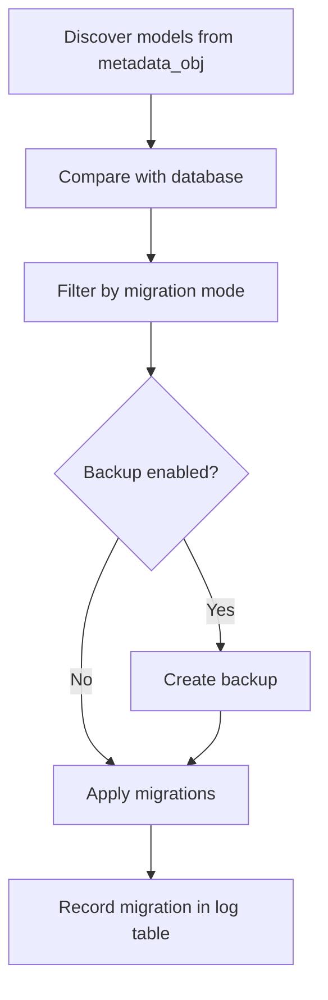

# Database and Migrations

ChaCC API handles database setup and migrations automatically. When you run the server, your models are discovered, tables are created, and migrations are applied—no extra commands needed.

**What this section covers:**
- [Quickstart](#quickstart)
- [Defining Models](#defining-models)
- [Migration Modes](#migration-modes)
- [How Migrations Work](#how-migrations-work)
- [Backup and Restore](#backup-and-restore)
- [Idempotency](#idempotency)
- [Migration Tracker Table](#migration-tracker-table)
- [Troubleshooting](#troubleshooting)
- [SQLite Compatibility](#sqlite-compatibility)
- [For Contributors: Migration Internals](#for-contributors-migration-internals)
- [Database Engines](#database-engines)
- [Summary](#summary)

---

## Quickstart

Let's get a model running in 3 steps.

### 1. Define your model

```python
from chacc_api import ChaCCBaseModel
from sqlalchemy import Column, String

class Project(ChaCCBaseModel):
    __tablename__ = "projects"
    name = Column(String, nullable=False)
```

That's it. Your model is now registered with the system.

### 2. Run the server

```bash
chacc run server --dev
```

### 3. Done

The table is created automatically. Check your database—`projects` is there.

---

## Defining Models

### The base model

Import `ChaCCBaseModel` to create tables. Model classes are discovered automatically from SQLAlchemy's declarative `metadata_obj`. 

**Note:** The legacy `@register_model` decorator is retained as a backward-compatible no-op. You don't need to use it.

### Table naming

The generated table name defaults to the class name in lowercase plus `s`:

```python
class Project(ChaCCBaseModel):
    # table name: projects
    pass
```

Override with `__tablename__`:

```python
class Project(ChaCCBaseModel):
    __tablename__ = "my_projects"
    # table name: my_projects
    pass
```

### UUID fields

`ChaCCBaseModel` includes a `uuid` field by default. It's stored as:
- Native PostgreSQL UUID in production
- 36-character string in SQLite

New rows receive **UUID7** instead of UUID4. Why? UUID7 preserves time ordering, which is better for database performance and indexing.

**Important:** Existing rows keep their UUID4 values. No migration is required. Only new records will use UUID7.

If you're on an older Python version without native UUID7 support, install `uuid-utils`:

```bash
pip install uuid-utils
```

### Timestamps

`ChaCCBaseModel` automatically sets:
- `created_at` – set on insert (if missing)
- `updated_at` – updated on every change

No manual configuration needed.

---

## Migration Modes

ChaCC runs migrations automatically on startup. You control how aggressive they are:

| Mode | Behavior | When to use |
|------|----------|-------------|
| **preview** | Shows pending operations without applying them | Testing or dry runs |
| **auto** (default) | Applies safe operations, skips destructive changes | Production day-to-day |
| **full** | Applies everything, including destructive changes | Major upgrades or controlled rollbacks |

Set the mode with an environment variable:

```bash
MIGRATION_MODE=full chacc run server --dev
```

### What's "safe"?

In `auto` mode, these operations are safe:
- Adding tables
- Adding columns
- Adding indexes
- Adding constraints (including foreign keys)
- Modifying types
- Modifying nullability
- Modifying defaults
- Enum synchronization

**Destructive operations** like dropping tables are **skipped in `auto` mode**.

### What about PostgreSQL enums?

If you're using PostgreSQL enums with `alembic-postgresql-enum`, the runner recognizes:
- `create_enum` – treated as safe
- `sync_enum_values` – treated as safe
- `drop_enum` – recognized but not safe

**Tip:** If enum metadata changes are detected, `alembic-postgresql-enum` must be installed to avoid migration failures.

---

## How Migrations Work

### The big picture



### Step by step

1. **Discovery** – ChaCC finds all models that inherit from `ChaCCBaseModel`.
2. **Comparison** – It compares the current state of your models to the existing database schema.
3. **Filtering** – Based on `MIGRATION_MODE`, it decides which operations to apply.
4. **Backup (optional)** – If `MIGRATION_BACKUP=true`, a backup is created before any changes.
5. **Application** – Migrations are applied to the database.
6. **Recording** – Each migration is logged in `chacc_migration_log`.

---

## Backup and Restore

### Enable backups

```bash
MIGRATION_BACKUP=true
MIGRATION_BACKUP_DIR=backups
```

### How backups work

- **SQLite** – The entire database file is copied.
- **PostgreSQL** – Uses `pg_dump` to create a SQL dump.

### Backup file names

Backups are timestamped:
- SQLite: `chacc_backup_YYYYMMDD_HHMMSS.db`
- PostgreSQL: `chacc_backup_YYYYMMDD_HHMMSS.sql`

### Restoring a backup

**SQLite:**
```bash
cp backups/chacc_backup_YYYYMMDD_HHMMSS.db chaccapi.db
```

**PostgreSQL:**
```bash
psql -d chaccapidb < backups/chacc_backup_YYYYMMDD_HHMMSS.sql
```

---

## Idempotency

The migration runner catches errors like `already exists` or `duplicate` and continues. This means:

- Running migrations multiple times is safe
- If something already exists, ChaCC doesn't fail
- The system recovers gracefully from partial states

**Practical example:** If you restart the server frequently during development, migrations won't bomb out because a table already exists.

---

## Migration Tracker Table

The runner creates `chacc_migration_log` to track what's been applied:

| Column | Purpose |
|--------|---------|
| `id` | Internal ID |
| `version_num` | Unique migration version |
| `description` | Human-readable summary |
| `checksum` | Hash of the operation details |
| `applied_at` | When it was applied |
| `rollback_available` | Whether rollback is possible |

This table is excluded from destructive drop detection—it won't be accidentally removed.

---

## Troubleshooting

### Migration fails with "already exists"

**The runner catches this and continues.** Check the log table to see what was applied.

### I'm stuck in a broken state

```bash
# Preview what would happen
MIGRATION_MODE=preview 

chacc run server

# Drop the problematic table or column manually
# Then restart
```

### PostgreSQL enum errors

Ensure you have installed `alembic-postgresql-enum`:

```bash
pip install alembic-postgresql-enum
```

### SQLite table not found

The migration runner handles this. If you see errors, check:
1. Your model is imported and registered in `metadata_obj`.
2. The table name matches what you expect.

### My migrations aren't running

Check your migration mode. If you're in `preview`, nothing will be applied.

### Want to see less log noise?

Use the `--verbose` flag sparingly. By default, migration logs are hidden for cleaner console output.

---

## SQLite Compatibility

SQLite has limitations with direct table alteration. ChaCC handles this by using `batch_alter_table()` for:
- Adding/dropping columns
- Modifying types, nullability, defaults
- Adding/dropping indexes and constraints

This avoids common SQLite migration pitfalls.

---

## For Contributors: Migration Internals

*You don't need this to use ChaCC, but here's what's happening under the hood if you're curious.*

### Dependency resolution

`MigrationDependencyResolver` builds a graph of pending migrations and validates that referenced tables exist (or are being created). It aborts with explicit errors when foreign-key targets are missing.

### Topological model discovery

`discover_and_import_models()` uses AST-based topological sorting to import modules in dependency order. This prevents duplicate model discovery and ensures `metadata_obj` reflects the full schema before migrations run.

### Operation execution

`MigrationOperationExecutor` handles dialect-specific behavior:
- PostgreSQL enum conflicts are caught and treated as idempotent
- Enum types are pre-created before adding enum-backed tables or columns

### SQLite table existence checks

The runner no longer passes a schema parameter to SQLite's `get_table_names()`. This fixes a false-negative bug that caused spurious synthetic migrations.

---

## Database Engines

| Engine | Use case | Notes |
|--------|----------|-------|
| **SQLite** | Local development, simple deployments | Stores `chaccapi.db` in the current directory. File name and path configurable via `SQLITE_DATABASE_NAME` and `SQLITE_DATABASE_PATH`. |
| **PostgreSQL** | Production | Uses native UUID, requires full connection settings. Supports enum migrations with `alembic-postgresql-enum`. |

---

## Summary

| What | How |
|------|-----|
| **Define a model** | Inherit from `ChaCCBaseModel` |
| **Run migrations** | Start the server – it happens automatically |
| **Preview changes** | Set `MIGRATION_MODE=preview` |
| **Full migration** | Set `MIGRATION_MODE=full` |
| **Backup** | Set `MIGRATION_BACKUP=true` |
| **Recover from failure** | Check the log table, preview changes, restart |

---

**The migration runner makes database management boring—and that's exactly what you want.**

Now go build something great.