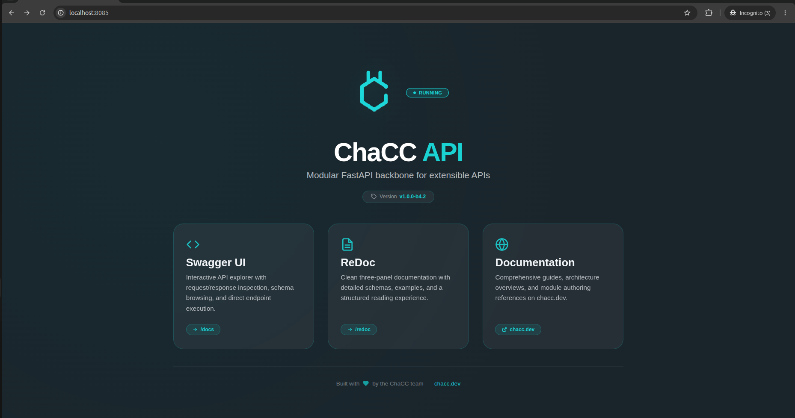

# Installation

ChaCC API can be installed from PyPI, from source, or through Docker. SQLite database file name and path can be customized with `SQLITE_DATABASE_NAME` and `SQLITE_DATABASE_PATH`. By default the database file `chaccapi.db` is created in the current working directory.

## Prerequisites

- Python 3.10 or newer
- `pip`
- Optional: PostgreSQL 15+ for production deployments
- Optional: Redis when `REDIS_ENABLED=true`

## Install from PyPI
Create project directory
```
mkdir my-project && cd my-project
```
Create virtual environment
```bash
python -m venv .venv
```
Activate virtual environment

Windows:
```bash
.\.venv\Scripts\activate
```
Linux/Mac:
```bash
source .venv/bin/activate
```

Start ChaCC Installation:

```bash
pip install chacc-api
```

Start the server:

```bash
chacc run server --dev
```

Open the browser and visit:

```text
http://localhost:8085/
```



## Install from source

> This installation method is useful if you want to test the actual package and possibly updating the package itself for contribution.

```bash
git clone https://github.com/tnet-tech/chacc-api
cd chacc-api
python -m venv .venv
source .venv/bin/activate
pip install -e .
```

Run the development server:

```bash
chacc run server --dev
```

## Docker

Pull and run the image:

```bash
docker pull chacc-api:latest
docker run -d -p 8085:8085 chacc-api:latest
```

Use Docker Compose for a PostgreSQL-backed service:

```bash
docker compose -f deployment/docker/docker-compose.yml up -d
```

The compose file includes a ChaCC API service, a PostgreSQL service, health
checks, and persistent volumes for PostgreSQL and module storage.

## Development checklist

```bash
# Scaffold your module
chacc create my_module
# Run development server to see it in action
chacc run server --dev
# Build your module and distribute as you wish
chacc build plugins/my_module
```

Recommended development settings:

```bash
CHACC_DEV_MODE=true
ENABLE_PLUGIN_HOT_RELOAD=true
PLUGIN_AUTO_DISCOVERY=true
ENABLE_PLUGIN_DEPENDENCY_RESOLUTION=true
```

## Production checklist

```bash
CHACC_DEV_MODE=false
ENABLE_PLUGIN_HOT_RELOAD=false
PLUGIN_AUTO_DISCOVERY=false
ENABLE_PLUGIN_DEPENDENCY_RESOLUTION=false
DATABASE_ENGINE=postgresql
SECRET_KEY=<random 32+ character secret>
```

Production startup validates these settings and refuses to start if required
configuration is missing or insecure.

# Database and Migrations

