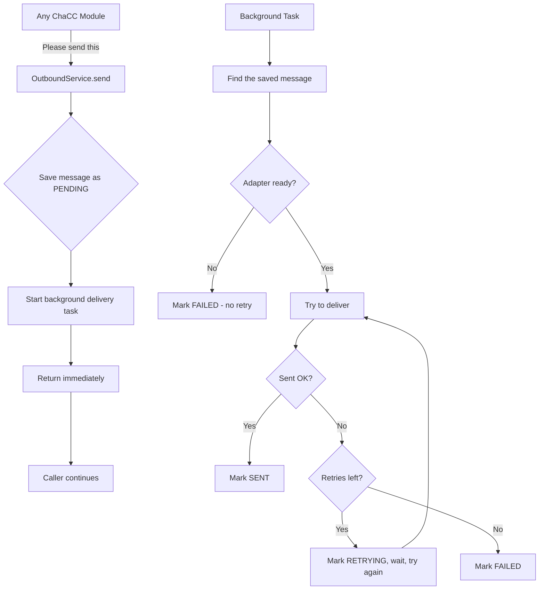
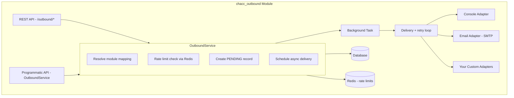

# Official ChaCC Outbound

> An official ChaCC API module for sending emails, SMS, and other messages from any module — with automatic retries, status tracking, and a clean admin API.

## Overview

`chacc_outbound` is your app's **messaging helper**. Other modules say *"send this email to this customer"* and the module handles:

- Choosing the right delivery method (SMTP, console for dev, or your custom adapter)
- Saving the message record so you can track it
- Retrying if delivery fails
- Updating the status so you know what happened

You don't need to know SMTP, Twilio, or any provider details. Just call `send()` and the module figures out the rest.

## Installation

Place this folder inside your ChaCC plugins directory:

```text
plugins/chacc_outbound/
```

Dependencies are managed by `chacc-api`.

## Settings

Settings are shared across the whole app via environment variables. Pick the adapter that matches your environment.

### Console (development)

No extra setup needed. Messages are printed to the console instead of being sent anywhere. Great for testing.

```bash
EMAIL_BACKEND=console
```

### SMTP (production email)

| Setting | What it is | Example |
|---------|-----------|---------|
| `EMAIL_BACKEND` | Use `smtp` for real email | `smtp` |
| `EMAIL_SMTP_HOST` | Your mail server address | `smtp.mailprovider.com` |
| `EMAIL_SMTP_PORT` | Usually `465` (SSL) or `587` (STARTTLS) | `465` |
| `EMAIL_SMTP_USERNAME` | Login for your mail server | `alerts@yourapp.com` |
| `EMAIL_SMTP_PASSWORD` | Password or app-specific password | `hunter2` |
| `EMAIL_SMTP_FROM` | The "from" address on outgoing emails | `noreply@yourapp.com` |
| `EMAIL_SMTP_USE_TLS` | Set `true` if your server needs explicit TLS | `true` |

```bash
EMAIL_BACKEND=smtp
EMAIL_SMTP_HOST=smtp.mailprovider.com
EMAIL_SMTP_PORT=465
EMAIL_SMTP_USERNAME=alerts@yourapp.com
EMAIL_SMTP_PASSWORD=your_password
EMAIL_SMTP_FROM=noreply@yourapp.com
EMAIL_SMTP_USE_TLS=true
```

### Module mappings (per-module behavior)

Per-module behavior — retries, backoff, rate limits, default adapter, and default channel — is stored in the database using the `OutboundModuleMapping` model. You configure these through the REST API, no code changes needed.

If no mapping exists for a module, these built-in defaults are used:

| Setting | Default |
|---------|---------|
| `max_retry_attempts` | `3` |
| `retry_backoff_seconds` | `300` (5 minutes) |
| `rate_limit_per_minute` | none |
| `default_adapter_name` | app-wide default (`console` in dev, `smtp` in production) |
| `default_channel` | `email` |

| Field | What it controls |
|-------|-----------------|
| `module_name` | The module this mapping applies to (e.g. `order_service`) |
| `max_retry_attempts` | How many times to retry a failed send before giving up |
| `retry_backoff_seconds` | Initial wait between retries. This doubles each attempt (60s → 120s → 240s...) |
| `rate_limit_per_minute` | Maximum sends per minute for this module. Requires Redis |
| `default_adapter_name` | Override the app-wide adapter for this module |
| `default_channel` | Default channel if not specified per send |
| `is_active` | Set to `false` to pause all sends for this module |
| `description` | Human-readable note for admins |

## How it works

### The big picture



### Message life cycle

```text
PENDING → SENT        (delivered successfully)
PENDING → RETRYING → SENT     (succeeded after retry)
PENDING → RETRYING → FAILED   (ran out of retries)
PENDING → FAILED      (missing config, bad adapter, etc.)
```

## Using it from another module

Everything is accessed through the module context. No direct imports from `chacc_outbound_src` are needed.

### Services exposed

| Service name | What it does |
|--------------|-------------|
| `outbound_service` | Send messages, check status, read module mappings |
| `outbound_adapter_registry` | Register and retrieve adapters by channel |
| `outbound_base_adapter` | Base class for custom adapters |
| `outbound_send_result` | Return type for adapter `send()` method |

> Module mappings are read-only through `outbound_service`. Use the REST API to create or update mappings.

### Send a message

```python
from .context_factory import get_module_context, get_db

context = get_module_context()
outbound_service = context.get_service("outbound_service")

async for db in get_db():
    result = await outbound_service.send(
        db=db,
        recipient_id="cust_123",
        recipient_contact="customer@example.com",
        subject="Your order has shipped",
        body="Your order ORD-001 has shipped. Tracking: TRK-456",
        module_name="order_service",
        channel="email",
    )
    await db.commit()
```

The `result` is a dictionary with the message UUID and current status. Since delivery happens in the background, the status may still be `PENDING` at this point — it updates shortly after.

| Option | Required? | Notes |
|--------|-----------|-------|
| `recipient_id` | Yes | Your internal order/user ID |
| `recipient_contact` | Yes | Email address or phone number |
| `subject` | For email | Ignored for SMS |
| `body` | Yes | The message content |
| `module_name` | Yes | Used for per-module settings (retries, backoff, rate limits) via `OutboundModuleMapping` |
| `channel` | No | Defaults to `email` |
| `adapter_name` | No | Override the default adapter for this send |
| `content_type` | No | `text/plain` or `html` (for email) |

### Check message status

```python
from .context_factory import get_module_context, get_db

context = get_module_context()
outbound_service = context.get_service("outbound_service")

async for db in get_db():
    status = outbound_service.get_status(db, message_uuid)
```

## REST API

Base path: `/outbound`

### Send a message

```bash
curl -X POST http://localhost:8085/outbound/send \
  -H "Content-Type: application/json" \
  -d '{
    "module_name": "order_service",
    "recipient_id": "cust_123",
    "recipient_contact": "customer@example.com",
    "subject": "Order shipped",
    "body": "Your order ORD-001 has been shipped.",
    "channel": "email",
    "adapter_name": "console",
    "content_type": "text/plain"
  }'
```

### List messages

```bash
# Basic list
curl http://localhost:8085/outbound/messages

# Filter
curl "http://localhost:8085/outbound/messages?module_name=order_service&status=SENT"

# Search
curl "http://localhost:8085/outbound/messages?search=customer@example.com"

# Paginated
curl "http://localhost:8085/outbound/messages?page=1&size=20"

# No pagination (return all)
curl "http://localhost:8085/outbound/messages?paging=false"
```

| Query param | What it does |
|-------------|-------------|
| `page` | Page number, starting at 1 |
| `size` | Results per page (1 to 1000) |
| `paging` | Set to `false` to return everything at once |
| `module_name` | Filter by module |
| `channel` | Filter by channel (`email`, `sms`, etc.) |
| `status` | Filter by status (`PENDING`, `SENT`, `RETRYING`, `FAILED`) |
| `search` | Search in UUID, module name, recipient contact, subject, and body |

Response shape:

```json
{
  "success": true,
  "message": "Data fetched successfully",
  "data": [ ... ],
  "total": 42,
  "pager": {
    "page": 1,
    "size": 10,
    "pages": 5
  }
}
```

### Get one message

```bash
curl http://localhost:8085/outbound/messages/019f90bf-a50b-7d13-8937-f6e98cabc71e
```

### Check message status

```bash
curl http://localhost:8085/outbound/messages/019f90bf-a50b-7d13-8937-f6e98cabc71e/status
```

Returns:

```json
{
  "uuid": "019f90bf-a50b-7d13-8937-f6e98cabc71e",
  "status": "SENT"
}
```

### Module mappings

```bash
# List all
curl http://localhost:8085/outbound/module-mappings

# Filter by module
curl "http://localhost:8085/outbound/module-mappings?module_name=order_service"

# Get one
curl http://localhost:8085/outbound/module-mappings/order_service

# Create
curl -X POST http://localhost:8085/outbound/module-mappings \
  -H "Content-Type: application/json" \
  -d '{
    "module_name": "order_service",
    "max_retry_attempts": 5,
    "retry_backoff_seconds": 60,
    "rate_limit_per_minute": 20,
    "default_adapter_name": "smtp",
    "default_channel": "email",
    "description": "Order notifications"
  }'

# Update
curl -X PUT http://localhost:8085/outbound/module-mappings/order_service \
  -H "Content-Type: application/json" \
  -d '{
    "max_retry_attempts": 10,
    "retry_backoff_seconds": 30
  }'

# Delete
curl -X DELETE http://localhost:8085/outbound/module-mappings/order_service
```

### List adapters

```bash
curl http://localhost:8085/outbound/adapters
```

Returns:

```json
{
  "success": true,
  "data": [
    {"name": "console", "channel": "email", "description": "Prints messages to the console for local testing"},
    {"name": "smtp", "channel": "email", "description": "Sends real emails via SMTP"}
  ]
}
```

## Message statuses

| Status | Meaning |
|--------|---------|
| `PENDING` | Message was saved and is waiting to be delivered |
| `SENT` | Delivered successfully |
| `RETRYING` | Delivery failed, will try again |
| `FAILED` | Gave up. Check `last_error` for why |

## Writing a custom adapter

Adapters are pluggable delivery backends. Each adapter handles one channel (`email`, `sms`, `push`, etc.). To add a new delivery method, subclass `BaseOutboundAdapter` and register it through the module context.

### Base classes

#### `SendResult`

Return this from `send()` to tell the framework what happened.

| Field | Required | Description |
|-------|----------|-------------|
| `status` | Yes | `"sent"` or `"failed"` |
| `message_id` | No | Always set to `messaging_uuid` for database tracking |
| `error_message` | No | Human-readable error if `status` is `"failed"` |
| `metadata` | No | Extra provider-specific data |

```python
# Success
SendResult(status="sent", message_id=messaging_uuid)

# Failure
SendResult(status="failed", message_id=messaging_uuid, error_message="Invalid phone number")
```

#### `BaseOutboundAdapter`

```python
class BaseOutboundAdapter(ABC):
    name: str = "base"  # Adapter identifier, e.g. "twilio"
    channel: str = "unknown"  # Channel this adapter handles, e.g. "sms"
    description: Optional[str] = None  # Human-readable description shown in /adapters

    @abstractmethod
    async def send(
        self,
        messaging_uuid: str,  # Unique message ID for tracing
        recipient_id: str,  # Your internal user/order ID
        recipient_contact: str,  # Destination (email, phone, etc.)
        metadata: Optional[dict] = None,
        subject: Optional[str] = None,
        body: Optional[str] = None,
        content_type: str = "text/plain",
    ) -> SendResult: ...

    @abstractmethod
    async def validate_contact(self, contact: str) -> bool: ...

    async def health_check(self) -> bool:
        return True
```

**Method rules:**

- `send()` — Deliver the message. Return `SendResult(status="sent", ...)` on success or `SendResult(status="failed", error_message="...")` on failure. Raising an exception will trigger the retry logic.
- `validate_contact()` — Return `True` if the contact format is valid for this channel. Called before `send()`.
- `health_check()` — Return `True` if the adapter is operational. Optional; defaults to `True`.

### Full example: Twilio SMS adapter

```python
import os
from twilio.rest import Client
from .context_factory import get_module_context

BaseOutboundAdapter = get_module_context().get_service("outbound_base_adapter")
SendResult = get_module_context().get_service("outbound_send_result")


class TwilioSMSAdapter(BaseOutboundAdapter):
    name = "twilio"
    channel = "sms"
    description = "Sends SMS via Twilio"

    def __init__(self):
        self.account_sid = os.environ["TWILIO_ACCOUNT_SID"]
        self.auth_token = os.environ["TWILIO_AUTH_TOKEN"]
        self.from_number = os.environ["TWILIO_FROM_NUMBER"]
        self.client = Client(self.account_sid, self.auth_token)

    async def send(
        self,
        messaging_uuid: str,
        recipient_id: str,
        recipient_contact: str,
        metadata=None,
        subject=None,
        body=None,
        content_type="text/plain",
    ) -> SendResult:
        try:
            message = self.client.messages.create(
                body=body or "",
                from_=self.from_number,
                to=recipient_contact,
            )
            return SendResult(
                status="sent",
                message_id=messaging_uuid,
                metadata={"twilio_sid": message.sid},
            )
        except Exception as exc:
            return SendResult(
                status="failed",
                message_id=messaging_uuid,
                error_message=str(exc),
            )

    async def validate_contact(self, contact: str) -> bool:
        return contact.startswith("+") and len(contact) > 10

    async def health_check(self) -> bool:
        try:
            self.client.request("GET", "/2010-04-01/Accounts.json")
            return True
        except Exception:
            return False
```

### Registering the adapter

```python
from .context_factory import get_module_context

context = get_module_context()
adapter_registry = context.get_service("outbound_adapter_registry")

adapter_registry.register(
    adapter=TwilioSMSAdapter(),
    channel="sms",
    name="twilio",
    set_default=True,
)
```

### Error handling and retries

The retry behavior depends on what your adapter does:

| Behavior | Framework action |
|----------|-----------------|
| Return `SendResult(status="sent")` | Mark `SENT`, stop retrying |
| Return `SendResult(status="failed")` | Mark `FAILED`, stop retrying immediately |
| Raise `AdapterConfigError` | Mark `FAILED`, stop retrying immediately |
| Raise retryable exception (network, timeout) | Mark `RETRYING`, wait, try again up to `max_retries` |
| Raise non-retryable exception (auth, bad number) | Mark `FAILED`, stop retrying immediately |

**Best practice:** Return `SendResult(status="failed", error_message="...")` for permanent failures you want to stop retrying. Raise an exception for transient failures you want the framework to retry.

## Debugging

### Nothing is being sent

1. Check the logs for `Adapter reported SENT` — if you see this, the adapter delivered successfully.
2. If you see `Adapter reported FAILED`, the adapter itself is failing. Check its config.
3. If you see `Adapter not found`, the adapter name is wrong or not registered.

### Status stays PENDING forever

1. Look for `Outbound delivery failed for <uuid>` — the background task crashed.
2. Look for `Background delivery task failed for <uuid>` — an unhandled exception killed the task.
3. If you see neither, the background task may not be starting. Check that the app is running and `module_context` is set.

### Retry behavior looks wrong

- `AdapterConfigError` and `AdapterNotFoundError` **do not retry** — they mark the message `FAILED` immediately.
- SMTP connection errors **do retry** — the message goes to `RETRYING` and waits before trying again.
- Authentication errors and bad recipient addresses **do not retry** — they mark the message `FAILED`.

### Common config mistakes

| Symptom | Likely cause |
|---------|-------------|
| `AdapterConfigError` | `EMAIL_SMTP_HOST` is empty or wrong |
| `SMTPAuthenticationError` | Wrong username/password |
| `SMTPSenderRefused` | `EMAIL_SMTP_FROM` address is not allowed by your mail server |
| `SMTPServerDisconnected` | Firewall, wrong port, or server down |

## Architecture



## Running tests

```bash
pytest plugins/chacc_outbound/chacc_outbound_src/tests/ -v
```

Or:

```bash
python plugins/chacc_outbound/chacc_outbound_src/run_tests.py
```

## License

MIT
